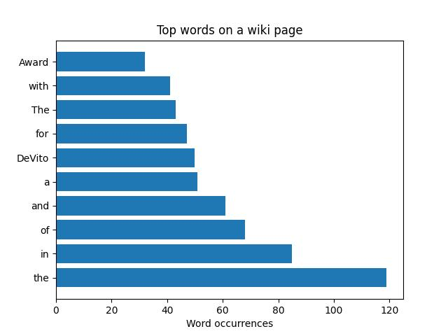

# WikiWordCounter

Counts the occurence of words in a given wikipedia page.

## Running

To run the program use the command

```
python counter.py
```

## Output

Example output on the Danny Devito wikipedia page 



## Author

**COLBY SULLIVAN**
